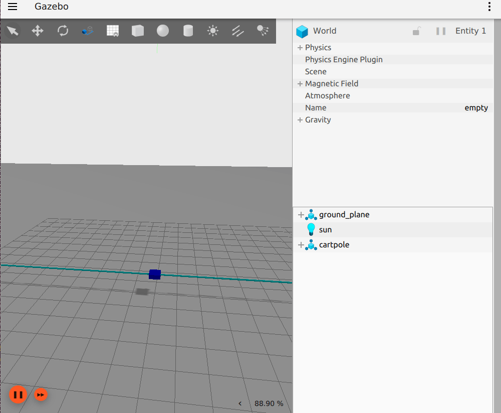
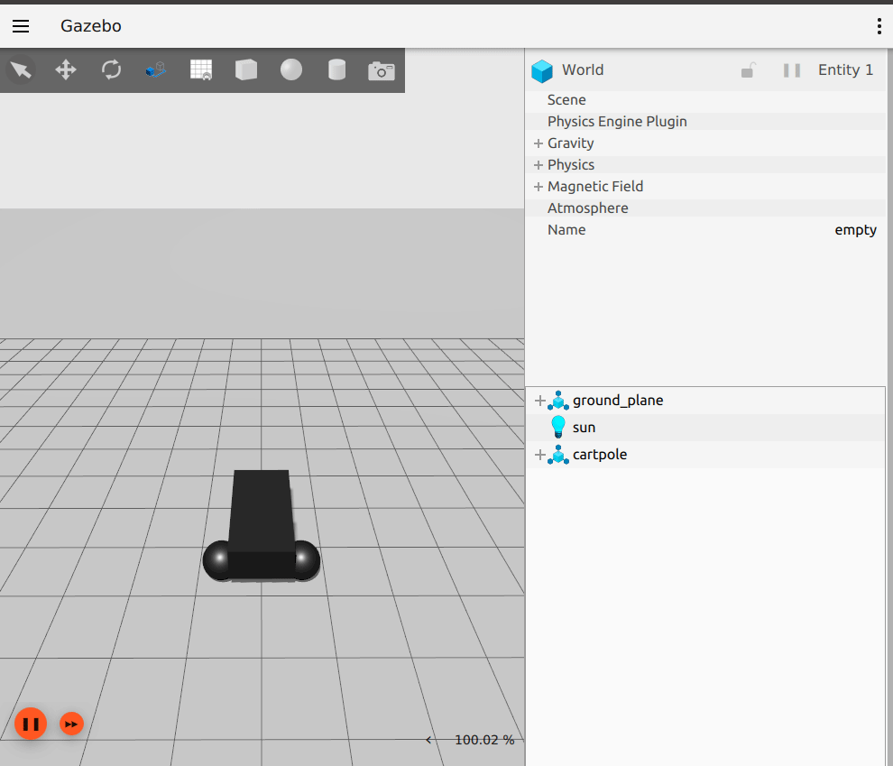

:github_url: https://github.com/ros-controls/gz_ros2_control/blob/{REPOS_FILE_BRANCH}/doc/index.rst

.. _gz_ros2_control:
.. _ign_ros2_control:

=====================
gz_ros2_control
=====================

This is a ROS 2 package for integrating the *ros2_control* controller architecture with the `Gazebo <https://gazebosim.org/home>`__ simulator.

This package provides a Gazebo-Sim system plugin which instantiates a *ros2_control* controller manager and connects it to a Gazebo model.

Installation
============

Binary packages
---------------
``gz_ros2_control`` is released for ROS 2 {DISTRO} on Ubuntu. To use it, you have to install ``ros-{DISTRO}-gz-ros2-control`` package, e.g., by running the following command:

.. code-block:: shell

  sudo apt install ros-{DISTRO}-gz-ros2-control ros-{DISTRO}-gz-ros2-control-demos

Building from source
--------------------
To use latest yet-to-be-released features or use a non-default Gazebo combination (see the compatibility matrix in the `README <https://github.com/ros-controls/gz_ros2_control/tree/humble?tab=readme-ov-file#compatibility-matrix>`__ for currently supported combinations), you have to build the package from source.

If you want compile this from source, you have to choose the Gazebo version first. The default one is ``fortress``, and you simply can compile it with

.. code-block:: shell

  mkdir -p ~/gz_ros2_control_ws/src
  cd ~/gz_ros2_control_ws/src
  git clone https://github.com/ros-controls/gz_ros2_control -b $ROS_DISTRO
  rosdep install -r --from-paths . --ignore-src --rosdistro $ROS_DISTRO -y
  cd ~/gz_ros2_control_ws
  colcon build

If you want to use ``harmonic``, then follow the instructions in the `official Gazebo Harmonic documentation <https://gazebosim.org/docs/harmonic/ros_installation/#gazebo-harmonic-with-ros-2-humble-or-rolling-use-with-caution>`__ how to install Gazebo Harmonic on ROS 2 humble, i.e, ``apt-get install gz-harmonic ros-humble-ros-gzharmonic ros-humble-ros-gzharmonic-bridge``. Additionally, you need to `install the rosdep rules <https://github.com/osrf/osrf-rosdep#installing-rosdep-rules-to-resolve-gazebo-harmonic-libraries>`__ for Gazebo Harmonic.

Then create a workspace, clone the correct branch of this repo and compile it by setting the environment variable ``GZ_VERSION``:

.. code-block:: shell

  mkdir -p ~/gz_ros2_control_ws/src
  cd ~/gz_ros2_control_ws/src
  git clone https://github.com/ros-controls/gz_ros2_control -b humble
  export GZ_VERSION=harmonic
  rosdep install -r --from-paths . --ignore-src --rosdistro $ROS_DISTRO -y --skip-keys="ros_gz_bridge ros_gz_sim"
  cd ~/gz_ros2_control_ws
  colcon build

Using docker
---------------------------------
Build the docker image

.. code-block:: shell

  cd Dockerfile
  docker build -t gz_ros2_control .

and run the demo

1. Using Docker

  Docker allows us to run the demo without the GUI if configured properly. The following command runs the demo without the GUI:

  .. code-block:: shell

    docker run -it --rm --name gz_ros2_control_demo --net host gz_ros2_control ros2 launch gz_ros2_control_demos cart_example_position.launch.py gui:=false

  Then on your local machine, you can run the Gazebo client:

  .. code-block:: shell

    gz sim -g

2. Using Rocker

  To run the demo with GUI we are going to use `rocker <https://github.com/osrf/rocker/>`__ which is a tool to run docker
  images with customized local support injected for things like nvidia support. Rocker also supports user id specific files for cleaner
  mounting file permissions. You can install this tool with the following `instructions <https://github.com/osrf/rocker/#installation>`__. (make sure you meet all of the `prerequisites <https://github.com/osrf/rocker/#prerequisites>`__.

  The following command will launch Gazebo:

  .. code-block:: xml

    rocker --x11 --nvidia --name gz_ros2_control_demo gz_ros2_control:latest

  The following commands allow the cart to be moved along the rail:

  .. code-block:: xml

    docker exec -it gz_ros2_control_demo bash
    source /home/ros2_ws/install/setup.bash
    ros2 run gz_ros2_control_demos example_position

Add ros2_control tag to a URDF
==========================================

Simple setup
-----------------------------------------------------------

To use *ros2_control* with your robot, you need to add some additional elements to your URDF.
You should include the tag ``<ros2_control>`` to access and control the robot interfaces. We should
include:

* a specific ``<plugin>`` for our robot
* ``<joint>`` tag including the robot controllers: commands and states.

.. code-block:: xml

  <ros2_control name="GazeboSimSystem" type="system">
    <hardware>
      <plugin>gz_ros2_control/GazeboSimSystem</plugin>
    </hardware>
    <joint name="slider_to_cart">
      <command_interface name="effort">
        <param name="min">-1000</param>
        <param name="max">1000</param>
      </command_interface>
      <state_interface name="position">
        <param name="initial_value">1.0</param>
      </state_interface>
      <state_interface name="velocity"/>
      <state_interface name="effort"/>
    </joint>
  </ros2_control>

Using mimic joints in simulation
-----------------------------------------------------------

To use ``mimic`` joints in *gz_ros2_control* you should define its parameters to your URDF.
We should include:

* ``<mimic>`` tag to the mimicked joint `detailed manual <https://wiki.ros.org/urdf/XML/joint>`__
* ``mimic`` and ``multiplier`` parameters to joint definition in ``<ros2_control>`` tag

.. code-block:: xml

  <joint name="left_finger_joint" type="prismatic">
    <mimic joint="right_finger_joint"/>
    <axis xyz="0 1 0"/>
    <origin xyz="0.0 0.48 1" rpy="0.0 0.0 3.1415926535"/>
    <parent link="base"/>
    <child link="finger_left"/>
    <limit effort="1000.0" lower="0" upper="0.38" velocity="10"/>
  </joint>

.. code-block:: xml

  <joint name="left_finger_joint">
    <param name="mimic">right_finger_joint</param>
    <param name="multiplier">1</param>
    <command_interface name="position"/>
    <state_interface name="position"/>
    <state_interface name="velocity"/>
    <state_interface name="effort"/>
  </joint>

Add the gz_ros2_control plugin
==========================================

In addition to the *ros2_control* tags, a Gazebo plugin needs to be added to your URDF that
actually parses the *ros2_control* tags and loads the appropriate hardware interfaces and
controller manager. By default the *gz_ros2_control* plugin is very simple, though it is also
extensible via an additional plugin architecture to allow power users to create their own custom
robot hardware interfaces between *ros2_control* and Gazebo.

.. code-block:: xml

  <gazebo>
    <plugin filename="gz_ros2_control-system" name="gz_ros2_control::GazeboSimROS2ControlPlugin">
      <robot_param>robot_description</robot_param>
      <robot_param_node>robot_state_publisher</robot_param_node>
      <parameters>$(find gz_ros2_control_demos)/config/cart_controller.yaml</parameters>
    </plugin>
  </gazebo>

The *gz_ros2_control* ``<plugin>`` tag also has the following optional child elements:

* ``<robot_param>``: The location of the ``robot_description`` (URDF) on the parameter server, defaults to ``robot_description``
* ``<robot_param_node>``: Name of the node where the ``robot_param`` is located, defaults to ``robot_state_publisher``
* ``<parameters>``: A YAML file with the configuration of the controllers. This element can be given multiple times to load multiple files.
* ``<controller_manager_name>``: Set controller manager name (default: ``controller_manager``)

Additionally, one can specify a namespace and remapping rules, which will be forwarded to the controller_manager and loaded controllers. Add the following ``<ros>`` section:

.. code-block:: xml

  <gazebo>
    <plugin filename="gz_ros2_control-system" name="gz_ros2_control::GazeboSimROS2ControlPlugin">
      ...
      <ros>
        <namespace>my_namespace</namespace>
        <remapping>/robot_description:=/robot_description_full</remapping>
      </ros>
    </plugin>
  </gazebo>

Default gz_ros2_control Behavior
-----------------------------------------------------------

By default, without a ``<plugin>`` tag, *gz_ros2_control* will attempt to get all of the information it needs to interface with a ros2_control-based controller out of the URDF. This is sufficient for most cases, and good for at least getting started.

The default behavior provides the following ros2_control interfaces:

* hardware_interface::JointStateInterface
* hardware_interface::EffortJointInterface
* hardware_interface::VelocityJointInterface

Advanced: custom gz_ros2_control Simulation Plugins
-----------------------------------------------------------

The *gz_ros2_control* Gazebo plugin also provides a pluginlib-based interface to implement custom interfaces between Gazebo and *ros2_control* for simulating more complex mechanisms (nonlinear springs, linkages, etc).

These plugins must inherit the ``gz_ros2_control::GazeboSimSystemInterface``, which implements a simulated *ros2_control*
``hardware_interface::SystemInterface``. SystemInterface provides API-level access to read and command joint properties.

The respective GazeboSimSystemInterface sub-class is specified in a URDF model and is loaded when the
robot model is loaded. For example, the following XML will load the default plugin:

.. code-block:: xml

  <ros2_control name="GazeboSimSystem" type="system">
    <hardware>
      <plugin>gz_ros2_control/GazeboSimSystem</plugin>
    </hardware>
    ...
  <ros2_control>
  <gazebo>
    <plugin filename="gz_ros2_control-system" name="gz_ros2_control::GazeboSimROS2ControlPlugin">
      ...
    </plugin>
  </gazebo>

Set up controllers
-----------------------------------------------------------

Use the tag ``<parameters>`` inside ``<plugin>`` to set the YAML file with the controller configuration
and use the tag ``<controller_manager_name>`` to set the controller manager node name.

.. code-block:: xml

  <gazebo>
    <plugin filename="gz_ros2_control-system" name="gz_ros2_control::GazeboSimROS2ControlPlugin">
      <parameters>$(find gz_ros2_control_demos)/config/cart_controller.yaml</parameters>
      <controller_manager_name>controller_manager</controller_manager_name>
    </plugin>
  <gazebo>

The following is a basic configuration of the controllers:

- ``joint_state_broadcaster``: This controller publishes the state of all resources registered to a ``hardware_interface::StateInterface`` to a topic of type ``sensor_msgs/msg/JointState``.
- ``joint_trajectory_controller``: This controller creates an action called ``/joint_trajectory_controller/follow_joint_trajectory`` of type ``control_msgs::action::FollowJointTrajectory``.

.. literalinclude:: ../gz_ros2_control_demos/config/cart_controller_position.yaml
   :language: yaml

gz_ros2_control_demos
==========================================

There are some examples in the *gz_ros2_control_demos* package.

Cart on rail
-----------------------------------------------------------

These examples allow to launch a cart in a 30 meter rail.

You can run some of the example configurations by running the following commands:

.. code-block:: shell

  ros2 launch gz_ros2_control_demos cart_example_position.launch.py
  ros2 launch gz_ros2_control_demos cart_example_velocity.launch.py
  ros2 launch gz_ros2_control_demos cart_example_effort.launch.py

When the Gazebo world is launched, you can run some of the following commands to move the cart.

.. code-block:: shell

  ros2 run gz_ros2_control_demos example_position
  ros2 run gz_ros2_control_demos example_velocity
  ros2 run gz_ros2_control_demos example_effort

Mobile robots
-----------------------------------------------------------

You can run some of the mobile robots running the following commands:

.. code-block:: shell

  ros2 launch gz_ros2_control_demos diff_drive_example.launch.py
  ros2 launch gz_ros2_control_demos tricycle_drive_example.launch.py
  ros2 launch gz_ros2_control_demos ackermann_drive_example.launch.py

When the Gazebo world is launched you can run some of the following commands to move the robots.

.. code-block:: shell

  ros2 run gz_ros2_control_demos example_diff_drive
  ros2 run gz_ros2_control_demos example_tricycle_drive
  ros2 run gz_ros2_control_demos example_ackermann_drive

To demonstrate the setup of a namespaced robot, run

.. code-block:: shell

  ros2 launch gz_ros2_control_demos diff_drive_example_namespaced.launch.py

which will launch a diff drive robot within the namespace ``r1``.

.. note::

  The ros2_control settings for the controller_manager and the controller defined in ``diff_drive_controller.yaml`` use wildcards to match all namespaces.

To run the Mecanum mobile robot run the following commands to drive it from the keyboard:

.. code-block:: shell

  ros2 launch gz_ros2_control_demos mecanum_drive_example.launch.py
  ros2 run teleop_twist_keyboard teleop_twist_keyboard --ros-args -p stamped:=true

Gripper
-----------------------------------------------------------

The following example shows a parallel gripper with a mimic joint:

.. code-block:: shell

  ros2 launch gz_ros2_control_demos gripper_mimic_joint_example.launch.py

Send example commands:

.. code-block:: shell

  ros2 run gz_ros2_control_demos example_gripper

Pendulum with passive joints (cart-pole)
-----------------------------------------------------------

The following example shows a cart with a pendulum arm:

.. code-block:: shell

  ros2 launch gz_ros2_control_demos pendulum_example_effort.launch.py
  ros2 run gz_ros2_control_demos example_effort

This uses the effort command interface for the cart's degree of freedom on the rail. To demonstrate that the physics of the passive joint of the pendulum is solved correctly even with the position command interface, run

.. code-block:: shell

  ros2 launch gz_ros2_control_demos pendulum_example_position.launch.py
  ros2 run gz_ros2_control_demos example_position
